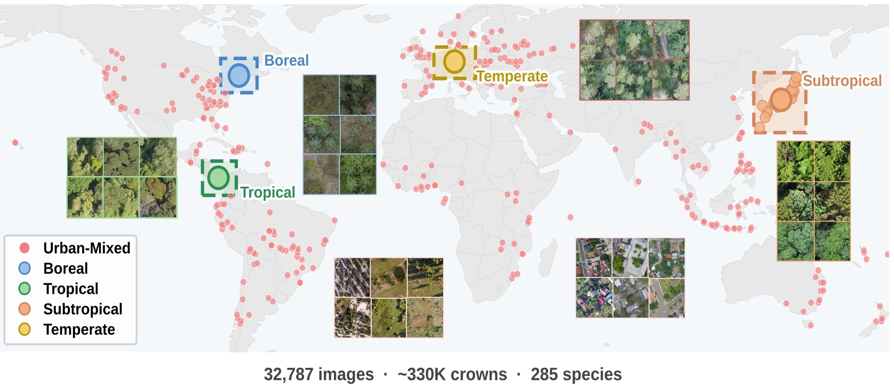
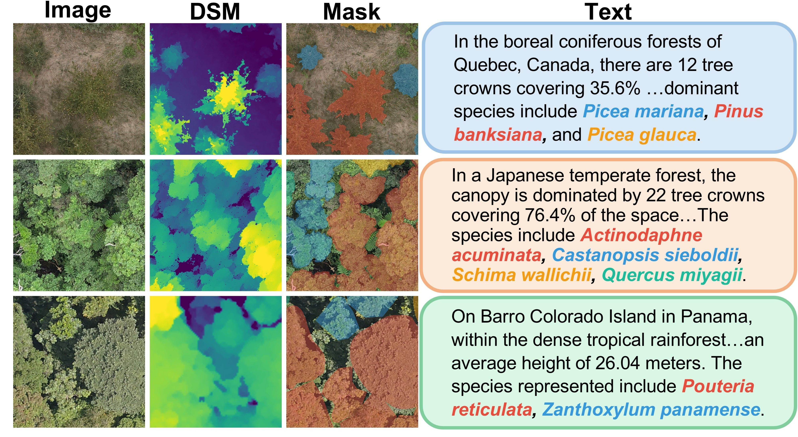

# TreeCrown-MM

### A Multimodal Remote Sensing Dataset for Joint Tree Crown Segmentation and Description

 

Mengjiao Tang &emsp; Yue Li &emsp; Sheng Xu &emsp; Yu Shen* &emsp; Qiaolin Ye*

Nanjing Forestry University

\* *Corresponding authors*

 

&ensp;

&ensp;

 

  

<b>Figure 1</b>: Geographic distribution of the five TreeCrown-MM scene types, with image and species statistics.

  

<b>Figure 2</b>: Representative quadruplets (RGB, DSM, Mask, Text) from TreeCrown-MM. Masks are colored by species.

## Highlights

- **Multimodal**: Each tile provides four aligned modalities — RGB image, DSM, semantic segmentation mask, and natural-language scene description.
- **Large-scale**: 32,787 tiles with ~330K annotated tree crowns and 285 species, substantially extending existing benchmarks.
- **Global coverage**: Five scene types (boreal, tropical, subtropical, temperate, urban-mixed) spanning North America, Central America, Europe, Asia, and additional continents.
- **Joint task**: A unified setting for tree crown segmentation and scene description, bridging spatial prediction and semantic understanding.
- **Benchmark**: Six vision-language models evaluated in zero-shot and fine-tuned settings, with a baseline model (TCM-LISA) incorporating DSM.

## Dataset Download

The dataset is publicly available on [🤗 HuggingFace](https://huggingface.co/datasets/huafei-77/TreeCrown-MM).

<!-- 
| Split | Tiles | Usage |
|-------|-------|-------|
| Training | 12,000 | Model training |
| Validation | 1,500 | Hyperparameter tuning |
| Test | 1,500 | Development evaluation |
| Benchmark | 3,000 | Standardized evaluation (600 per scene type) |
| Remaining | 14,787 | Pre-training or domain adaptation |
-->

## Citation

Coming soon.

## License

The TreeCrown-MM annotations and metadata are released under [CC BY-NC 4.0](https://creativecommons.org/licenses/by-nc/4.0/). Source imagery is subject to the original license of each source dataset.
